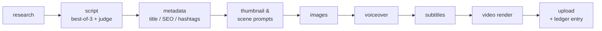
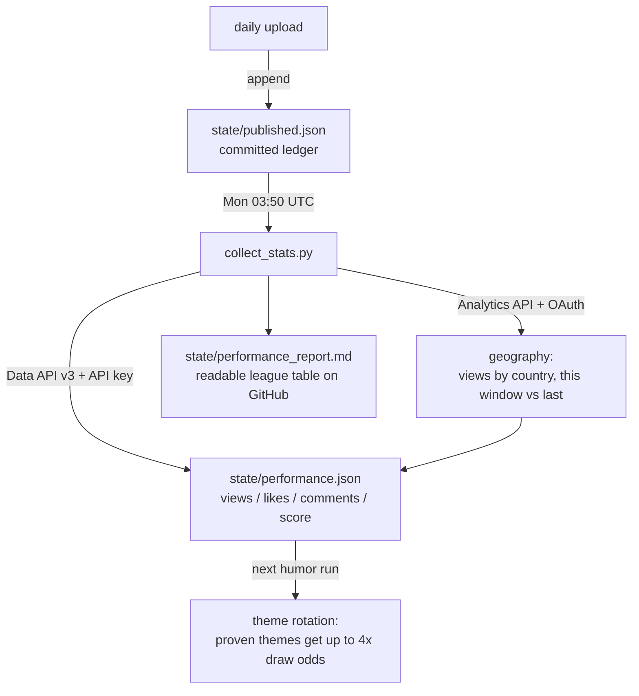

# AI YouTube Automation System

A production-ready, **fully-free-capable** system that runs a YouTube Shorts channel end to end:
it discovers topics, writes and quality-gates scripts, generates images, voiceover, subtitles and
a finished video, uploads it — then **learns from real view/like/comment data** to make the next
video better.

> Visibility: the library default is **private** (`YOUTUBE_UPLOAD_PRIVACY=private`), so a fresh
> checkout can never publish by accident. The scheduled workflows in this repo deliberately
> override it to **public** — the channel runs unattended, and for Shorts the cron is the publish
> time. Set the `privacy` input on a `workflow_dispatch` run, or change the env in the workflow,
> to put a human back in the loop.

---

## Content streams

| Stream | What it makes | Source of topics |
|--------|---------------|------------------|
| **AI News** (`news`) | Daily developer-focused AI news Shorts — new models, releases, what actually ships | RSS / trend feeds (Reddit TIL, Google Trends, YouTube RSS), deduped against history |
| **Dev Humor** (`dev_humor`) | Bittersweet developer comedy — programming concepts as heartbreak metaphors (*"She was my primary key, but in her query she never called me."*) | 25 curated themes (SQL, git, async, regex, HTTP codes, broken quotes…), rotation weighted by measured engagement |
| **Code Heartbreak** (`code_heartbreak`) | Sad one-sided-love coding quotes — short poetic reels, pure pining, no punchline (*"I run on her localhost. She never deployed me."*) | 20 curated themes (background process, commented-out line, read replica, localhost…), same engagement-weighted rotation |
| **Trending Long-Form** (`news` + `--format long`) | 4-6 minute 16:9 videos on India's trending news, twice a week — long-form watch time to complement the Shorts | Google Trends IN, grounded in the English news headline each trend carries; safety-filtered, deduped against daily news |

---

## The generation pipeline

Every video runs through a **LangGraph** state machine. Each stage persists its output to the
database, so the dashboard shows live progress and failed runs are inspectable.



### Script quality gate (best-of-N + LLM judge)

The script decides retention, likes and shares more than anything downstream — and single-shot
free models produce very uneven drafts. So the script stage:

1. Generates **3 candidate drafts** at varied temperatures (comedy runs hotter than news, so drafts genuinely differ)
2. An **LLM judge ranks them** against an engagement rubric — hook-in-2-seconds, concrete specifics, payoff, quotable last line — and only the winner gets rendered
3. The gate never sinks a run: judge failures fall back to the first draft, individual draft failures are tolerated

Set `SCRIPT_CANDIDATES=1` to disable (single-shot, cheapest). Cost of the gate is ~4 LLM calls
per video instead of 1 — free on OpenRouter's free tier.

### Scripts are written for a synthetic voice

Every script prompt carries a shared delivery block, because **punctuation is the only pacing
control that exists here.** `edge-tts` escapes its input into SSML before sending it, so a
`<break>` tag arrives at the service as literal text — and comes back out as a caption token.
There is no way to inject a pause after the fact.

So the prompts ask for short declarative sentences that always close on a full stop, `...` for a
held beat before a reveal, and no ALL CAPS (text normalisation spells unknown capitals out letter
by letter, turning `NULL` into "en you ell ell" — the trap the developer-themed streams walk
straight into). Numbers and symbols are requested in spoken form: "1.2 billion dollars", not
`$1.2B`. That last rule does double duty — it fixes the delivery *and* keeps the word timings
matchable back to the script, since an expanded token is exactly what defeats the punctuation
recovery above. Curly quotes, ellipses and emoji are normalised in `_clean_text` rather than at
synthesis, so the stored script, the audio and the captions all remain the same string.

### Performance feedback loop

The pipeline doesn't just publish — it measures what worked and steers itself:



- **Score** = likes + 2 × comments + views/100 — likes/comments dominate on purpose: for Shorts,
  raw views mostly measure the feed algorithm, while reactions measure the content.
- Untested themes always keep base exploration weight, so rotation never tunnel-visions.
- All cross-run state is **committed JSON in `state/`** (not the DB) because CI runners are
  ephemeral — the repo itself is the channel's memory.
- **Geography needs OAuth, not the API key.** View and like counts are public, but the country
  breakdown is owner-only data that the Data API cannot return at all — it comes from the
  YouTube Analytics API and needs a token carrying `yt-analytics.readonly`. Re-run
  `python scripts/youtube_auth.py` and refresh the `YOUTUBE_TOKEN_JSON` secret to enable it; a
  token without the scope logs a warning and the rest of the stats collect as normal.
- The country table reports **absolute views before shares**, on purpose. Share is a ratio and
  moves when either side does, so a country can shed several points in a window where its own
  views never fell — the channel simply grew elsewhere. Reading the percentage alone turns that
  into a phantom problem to chase.

---

## Video rendering: captions and motion

The script decides whether a video is worth watching; the render decides whether it *looks*
worth watching. Two parts do most of that work, and both are tuned for a specific failure mode.

### Word-by-word animated captions

Captions are emitted as **ASS** and burned by **libass** (bundled with FFmpeg), not as static
SRT blocks. libass draws vector text per frame, so colour cross-fades and scale animation are
smooth and the glyphs stay sharp — no per-frame image rasterisation, no ImageMagick.

**Timing** comes from the voiceover itself, in descending order of accuracy:

1. `edge-tts` is asked for `WordBoundary` events, giving an exact offset per spoken word, written
   to a `voiceover.words.json` sidecar. *(Ask for the default `SentenceBoundary` instead and one
   cue can cover a whole sentence — the same script yields 4 cues instead of 35.)*
2. `faster-whisper` with `word_timestamps=True`, for TTS providers that can't supply timings.
3. Failing both, word positions are interpolated inside each SRT cue, weighted by token length.

**Punctuation is recovered, not reported.** `WordBoundary` events carry the bare orthographic
word — the service says `rates`, never `rates,` — so the tokens are matched back against the
source script and the dropped punctuation is re-attached before the sidecar is written. This is
load-bearing twice over: it is why captions read as sentences, and it is what lets phrases break
where sentences end (that rule tests for terminal punctuation, so on raw `WordBoundary` data it
could never fire and captions straddled sentence boundaries).

The matcher takes only what sits provably *between* two located tokens, rather than absorbing
whatever trails one. When the speech service expands a token — `$1.2B` becomes `1.2 billion
dollars` — there is no way to know where the next token starts, and an absorb would swallow the
wrong span. Unmatched tokens simply get nothing, and if fewer than 80% match, the whole script
is left unpunctuated: half-punctuated output breaks phrases at arbitrary points and reads as a
bug rather than a style. Abbreviations (`U.S.`, `vs.`, `etc.`) are excluded from the sentence
test so they don't split a line mid-thought.

**Alignment** is the part that is easy to get wrong. If the highlighted word changes size, every
word after it shifts and the line visibly wobbles. So the animation is split in two:

- the **phrase** scales in once as it appears, anchored with `\an5` + `\pos` so it grows
  symmetrically about a fixed point;
- the **active word** only cross-fades to the accent colour, which cannot change line metrics.

**Emphasis** works within that rule rather than against it. Key words — numbers and versions,
acronyms and product names, and the closing line — are held in a second colour at a *constant*
112%, never animated mid-phrase, so the metrics stay fixed for the phrase's whole life. Two ASS
details make or break this: an inline `\fscx` overrides the line-level entry pop (leaving the
emphasised word frozen while the rest of the line grows around it), and `\fscx` persists until
overridden (so one emphasised word would enlarge every word after it). Both are handled by
emitting an explicit scale on every run of an emphasised line, separators included. Emphasis is
rate-limited to one run every few words; unlimited, the rules fire on a third of a technical
script and the second colour stops meaning anything.

Phrase widths are **measured against the real font file** rather than estimated from a character
count, because a phrase that overflows would wrap onto a second line — and a centred two-line
block sits higher than a one-line block, shifting the captions between phrases. An emphasised
line is measured as the joined string plus only the *extra* width its scaled runs contribute, so
an ordinary phrase measures exactly as it always did, kerning included.

| Style | Used by | Look |
|---|---|---|
| `default` | news, dev humor, longform | Anton, uppercase, amber active word, cyan emphasis on key words, 60% frame height (clear of YouTube's Shorts UI rail); landscape moves it to a lower third. Draws terminal punctuation (`. ! ?`) only — at ~88px a comma reads as a speck on the glyph |
| `quote` | code heartbreak | Sentence case, italic, soft blue highlight, dead centre — reads as an on-screen quote rather than a chant. Emphasis off and full punctuation drawn: the reel is set as written prose, and a cyan number would fight everything else in the frame |

### Camera motion

Still images get a Ken Burns move rendered by **sub-pixel cropping**: the source is sampled
through a floating-point crop box, so the window advances in fractional pixels. The obvious
approach — scaling the clip per frame — rounds to whole pixels every frame, which reads as
judder. Six moves (push in, pull out, pan, drift) cycle per scene, eased with smoothstep so each
starts and stops gently, and scenes are joined with a 0.5s crossfade.

The source is pre-scaled so the *most zoomed-in* moment of a move is pixel-for-pixel 1:1 — the
image is only ever downsampled, never enlarged, which is what keeps it sharp. Encoding runs at
CRF 18, because the caption burn re-encodes the file and generation loss on gradients is what
makes AI slideshows look muddy.

### Cut rhythm

Scene count follows the narration's own length rather than a fixed number, so a 20-second
heartbreak quote and a 6-minute long-form video both cut at a sensible pace: `SECONDS_PER_SCENE`
(5s for Shorts, 20s for long-form) against an estimate at ~150 wpm, capped by `MAX_SCENES_SHORT` /
`MAX_SCENES_LONG`.

Shorts ran at 8s for the first 100 videos — six or seven stills on a 50-second script, slow for a
format whose competition cuts every two to four seconds. Tuning this down is not free: images
generate **serially** (the free Pollinations endpoint allows one request per IP, and parallelism
measurably degraded quality) at ~35s each, so every extra scene is ~35s of run time per video
against `RUN_BUDGET_MINUTES`. If a run does overrun, `run_daily`'s budget guard stops starting new
videos rather than being cancelled mid-render — so the failure mode is fewer videos that day, not
a broken run.

Scene seeds mix in the project id, so a repeated theme can't regenerate a byte-identical picture
while re-rendering the same project still reproduces it exactly.

### Audio mastering

The finished mix is normalized to **-14 LUFS** (EBU R128 integrated), YouTube's playback target.

This matters more than it sounds. YouTube's normalization is one-way — it turns loud uploads
*down* and leaves quiet ones exactly as they are — so a quiet master isn't corrected, it just
plays quieter than everything around it in the feed. The first 100 uploads measured -20.9 and
-20.7 LUFS: about 7 dB down on a correctly mastered Short, which on mobile is a swipe rather than
a reach for the volume key.

Normalization runs **two-pass**: an analysis pass measures the real mix, then a corrective pass
applies one constant gain in loudnorm's `linear` mode. Single-pass loudnorm is dynamic — it rides
the gain as it goes and, knowing nothing about the material at the start, pumps audibly through
the first few seconds, which on a Short is exactly the part that decides whether anyone stays.
Analysis decodes audio only and discards the output, so it runs at ~25x realtime.

The music bed is mixed **before** the measurement, so the loudness that lands is the one the
viewer actually hears. Video is stream-copied throughout, so the whole stage costs a couple of
seconds. Three rungs — two-pass, single-pass, then the plain mix with no normalization — mean a
failure degrades the audio rather than the render.

### Fonts are committed, not installed

Production renders run on **`ubuntu-latest`** CI runners, which share almost no fonts with a
Windows or macOS dev machine. Without a bundled face, libass silently substitutes whatever
fontconfig picks and the captions you reviewed locally are not the ones your channel publishes.

So [`assets/fonts/`](assets/fonts/) holds the face itself (Anton, SIL OFL) and FFmpeg is pointed
at it with `fontsdir` — no system install needed, and CI output matches local output exactly.
The style chain ends at DejaVu Sans, which is always present on Ubuntu, so a missing file
degrades the look but never breaks a render.

---

## Design philosophy: a workflow, not an agent

This project uses **LangGraph** (an agent framework) — but deliberately as a **fixed workflow**,
not an autonomous agent. Every run takes the same path; no LLM ever decides *what to do next*.

| | This project (workflow) | An agent |
|---|---|---|
| Control flow | Fixed by code (`research → script → … → video`) | Chosen by the LLM at runtime |
| Tool use | Called at predetermined steps | Picked dynamically from a toolbox |
| Failure mode | Predictable, resumable, inspectable | Can wander, loop, burn tokens |
| Cost per run | Known upper bound | Open-ended |

**Why:** this pipeline runs unattended on a schedule and publishes to a real channel. An
unattended overnight run should be boringly predictable — deterministic flow means a failed run
points at exactly one stage, and a passing run costs exactly the same as yesterday's.

It still borrows the *useful* parts of agentic design, without giving up control:

- **LLM-as-judge** — one model evaluates another's drafts and picks the winner (evaluator
  pattern), but its verdict selects content, never changes the graph's path.
- **Environmental feedback** — real engagement data reweights future theme selection, but by
  arithmetic, not by an LLM reasoning about it.
- **Model fallback chains + retries** — resilience at every LLM call, with bounded attempts.

The natural place to add true agency later: a bounded self-correction loop at the script stage
(judge scores all drafts low → regenerate with the critique injected → re-judge, capped at 1–2
iterations). LangGraph's conditional edges support this directly.

---

## Architecture

Two ways to run the same pipeline:

### 1. CI mode (zero infrastructure — how the channel actually runs)

GitHub Actions runs everything on a schedule. No server, no database to host, no cost.

| Workflow | Runs at | Goes live at | What it does |
|----------|---------|--------------|--------------|
| `daily-video.yml` | 21:00 UTC daily | **22:30 + 22:45 UTC** | Discover AI news → generate → upload → record ledger |
| `daily-humor.yml` | 23:00 UTC daily | **00:30 UTC** | Pick humor theme (engagement-weighted) → generate → upload → record ledger |
| `daily-heartbreak.yml` | 00:30 UTC daily | **02:00 UTC** | Pick heartbreak theme (engagement-weighted) → generate → upload → record ledger |
| `weekly-longform.yml` | Wed + Sat 17:50 UTC | **21:00 UTC** (ceiling) | Google Trends IN → 4-6 min 16:9 video → upload → record ledger |
| `weekly-stats.yml` | Mondays 03:50 UTC | — | Fetch stats + country breakdown for every ledger video → commit `performance.json` + report |

**The cron is not the publish time — `YOUTUBE_PUBLISH_SLOT` is.** Uploads go up private with
`status.publishAt`, and YouTube flips them public itself at the exact minute in the table above.
A `workflow_dispatch` run with privacy set to anything but `public` skips scheduling entirely
and behaves as before.

This replaced an earlier scheme where the cron *was* the publish time, nudged to `:50` on the
theory that asking ten minutes early would absorb GitHub's queue delay. Measured over
2026-08-05..19, it did not: the median news Short went live 47 minutes after its cron, humor 18
minutes, and heartbreak **2h39m**. A publish slot that moves by hours cannot be tuned, because
the drift is larger than any change worth making. GitHub offers no latency guarantee, so the fix
is to stop asking it for one — the runner can start whenever it likes, and the video still
surfaces at the same minute every day.

The slots themselves target US evening (22:30 UTC = 18:30 ET / 15:30 PT). The old 12:50 UTC news
cron put the two daily news Shorts — half of all output — at 19:07 IST, Indian prime time, and
09:37 ET, a dead US slot. Long-form is the one stream where the slot is a ceiling rather than a
target: its render genuinely takes 1–3 hours, so a run that finishes past 21:00 UTC publishes
immediately instead of waiting a week (`YOUTUBE_PUBLISH_MAX_LEAD_HOURS`).

### 2. Server mode (dashboard + API)

```
                         ┌──────────────────────────────────────────────┐
                         │              FastAPI backend (JWT)            │
                         │  /auth /topics /projects /approval /publish   │
                         └───────────────┬──────────────────────────────┘
                                         │
        APScheduler (cron) ──► Celery ──►│──► LangGraph pipeline
        "discover every 6h"    (Redis)   │
                         ┌───────────────▼──────────────┐        ┌──────────────────┐
                         │   PostgreSQL (SQLAlchemy)     │◄──────►│  React dashboard  │
                         │   projects / assets / logs    │        │  (approve/reject) │
                         └───────────────────────────────┘        └──────────────────┘
```

Each media capability (LLM, TTS, images, subtitles, video) is a **pluggable provider** selected
by config, so you can run 100% free/local or swap in paid APIs without touching pipeline code.

---

## Tracing (optional)

Set `LANGSMITH_TRACING=true` + `LANGSMITH_API_KEY` and every run is recorded to
[LangSmith](https://smith.langchain.com): each graph node with its input and output state,
each LLM call with the model that actually served it, and the script judge's verdict.

**No new dependency.** The pipeline is a real `langgraph.StateGraph` and `langchain-core`
already hard-requires the `langsmith` SDK, so LangGraph instruments its own nodes the moment
the environment is set. The one thing the framework can't see is the LLM client — it talks to
OpenRouter/Gemini over raw `httpx` rather than through a LangChain chat model — so those calls
carry an explicit `@traceable` in [`llm.py`](backend/app/pipeline/llm.py).

What a trace answers that logs and `state/` do not:

| Question | Where it shows up |
|---|---|
| Why did *this* draft get published? | `script_judge` span — winner, per-draft scores, the judge's one-line reason |
| Which model actually answered? | `llm_chat` span — the winning model plus every failover before it (`failovers`, `sweeps`) |
| Why did this video look bad? | `images` span — `placeholders` vs `real`; a video made of gradients has a high count |
| Why are captions static? | `voiceover` span — `word_timings: false` means the sidecar is missing and captions silently fell back to SRT |

Two design rules this follows:

- **Off by default.** With tracing disabled the decorators degrade to a plain function call and
  nothing leaves the machine, so the zero-infrastructure default is intact. In CI it is
  self-arming: `LANGSMITH_TRACING: ${{ secrets.LANGSMITH_API_KEY != '' }}` means adding the
  secret turns it on and removing it turns it off, with no workflow edit.
- **It can never break a render.** The SDK batches spans on a background thread and swallows
  transport errors, and everything in [`tracing.py`](backend/app/core/tracing.py) preserves
  that — a missing key logs a warning and disables itself, and an unreachable endpoint still
  returns the traced function's real value.

Traces contain full prompts and generated scripts. Treat the API key like any other secret and
keep the LangSmith project private.

---

## Free-first provider matrix

| Capability     | Free default (no key)        | Free/local alternative     | Paid (optional)      |
|----------------|------------------------------|----------------------------|----------------------|
| LLM            | OpenRouter `*:free` models   | Ollama (local)             | any OpenRouter model |
| Trends         | Reddit TIL / Google Trends   | YouTube RSS / search       | —                    |
| Images         | Pollinations.ai (no key)     | Stable Diffusion / FLUX    | OpenAI Images        |
| Voiceover      | Edge TTS (keyless)           | Piper / Kokoro (local)     | ElevenLabs           |
| Subtitles      | Edge TTS `WordBoundary` timings | faster-whisper (local)  | —                    |
| Captions       | Animated ASS via libass (bundled with FFmpeg) | static SRT burn-in | —          |
| Video          | MoviePy + FFmpeg (local)     | —                          | —                    |
| Stats          | YouTube Data API v3 (free API key) | —                    | —                    |
| DB / Queue     | SQLite (CI) / PostgreSQL + Redis (server) | —             | —                    |

Everything in the "Free default" column runs **without paying anyone**. You only need a free
[OpenRouter](https://openrouter.ai) API key for the LLM.

---

## Setup

> 📖 **New here? Follow the [Complete Setup Guide](docs/SETUP.md)** — a step-by-step
> walkthrough from zero to a self-running channel (~30 min, $0), with a verification
> check after every part and a troubleshooting table.

The short version:

### CI mode (recommended)

Fork/clone, then add these **GitHub Actions secrets** (repo → Settings → Secrets and variables → Actions):

| Secret | What it is |
|--------|------------|
| `OPENROUTER_API_KEY` | Free key from [openrouter.ai](https://openrouter.ai) — powers all LLM stages |
| `YOUTUBE_CLIENT_SECRET_JSON` | Contents of the OAuth Desktop client JSON (Google Cloud, YouTube Data API v3 enabled) |
| `YOUTUBE_TOKEN_JSON` | Contents of the minted OAuth token (`python scripts/youtube_auth.py`, or the `/publish/authorize` flow). Carries `youtube.upload` **and** `yt-analytics.readonly` — the latter is what makes the country breakdown possible. A token minted before that scope was added keeps uploading fine; it just skips geography until re-minted |
| `YOUTUBE_API_KEY` | Plain API key restricted to YouTube Data API v3 — **read-only public stats** for the feedback loop. Needed because the OAuth token cannot read view/like counts for arbitrary videos, and the API key cannot read geography: the two credentials cover different halves of the loop |

That's it — the five workflows take over.

**To test one without publishing:** Actions tab → pick a workflow → **Run workflow** with
`dry_run: true`. It generates everything and skips the upload. Each run attaches the rendered
MP4 (plus the `.ass` captions and `.srt`) as a downloadable artifact, so you can watch the
result before anything reaches the channel.

### Docker (server mode)

```bash
cp .env.example .env          # then edit: set OPENROUTER_API_KEY and JWT_SECRET_KEY
docker compose up --build
```

- API + Swagger docs: http://localhost:8000/docs
- Dashboard: http://localhost:5173
- Default admin is bootstrapped from `FIRST_ADMIN_EMAIL` / `FIRST_ADMIN_PASSWORD` in `.env`.

### Local dev (no Docker)

Prereqs: **Python 3.12** (some ML wheels lag on 3.13/3.14), Node 20+, FFmpeg on PATH.
PostgreSQL + Redis only needed for server mode; the scripts run on SQLite.

```bash
# backend
python -m venv .venv && . .venv/Scripts/activate      # Windows: .venv\Scripts\activate
pip install -e ".[dev]"
alembic upgrade head
uvicorn app.main:app --reload --app-dir backend       # API
celery -A app.core.celery_app.celery worker -l info   # worker  (separate shell)
celery -A app.core.celery_app.celery beat  -l info    # scheduler (separate shell)

# frontend
cd frontend && npm install && npm run dev

# or skip the server entirely — one-shot runs:
python scripts/run_daily.py --content-type news --dry-run
python scripts/run_daily.py --content-type dev_humor --count 1
python scripts/collect_stats.py
```

---

## Project layout

```
backend/app/
  core/        config, logging, tracing (LangSmith), security (JWT), celery
  db/          SQLAlchemy models + session
  schemas/     Pydantic request/response models
  api/routes/  auth, topics, projects, approval, publish
  pipeline/    LangGraph graph + nodes + prompts + judge + OpenRouter client
  media/       tts/ images/ subtitles/ video/  (pluggable providers)
  services/    trend discovery, YouTube upload, performance feedback loop
  tasks/       Celery tasks
  scheduler/   APScheduler cron jobs
frontend/      React + TypeScript + Tailwind dashboard
scripts/
  run_daily.py       one-shot CI run: discover → generate → upload → ledger
  collect_stats.py   weekly stats collection + markdown report
  make_music_beds.py regenerates the synthesized music beds in assets/music/
state/                     the channel's committed memory (survives ephemeral CI)
  seen.json                news stories already covered
  seen_dev_humor.json      humor themes used recently (rotation)
  seen_code_heartbreak.json  heartbreak themes used recently (rotation)
  published.json           ledger of every upload (feeds stats collection)
  performance.json         measured stats per video (drives theme weighting)
  performance_report.md    human-readable league table — check it on Mondays
assets/
  fonts/                   caption fonts, committed so CI renders match local (see its README)
  music/<content_type>/    background-music beds, synthesized (see its README); empty = no music
.github/workflows/         daily-video, daily-humor, daily-heartbreak, weekly-longform, weekly-stats
alembic/                   migrations
tests/                     pytest (99 tests: quality gate, feedback loop, captions, punctuation
                           recovery, emphasis, tracing, motion, mastering, topic filter)
```

---

## Key configuration

All via environment variables / `.env` (see `backend/app/core/config.py` for the full list):

| Variable | Default | Purpose |
|----------|---------|---------|
| `LLM_MODELS` | free Gemma chain | Comma-separated OpenRouter fallback chain |
| `SCRIPT_CANDIDATES` | `3` | Drafts per video for the quality gate; `1` = single-shot |
| `MAX_TOPICS_PER_RUN` | `3` | Videos per discovery run |
| `YOUTUBE_UPLOAD_PRIVACY` | `private` | Keep `private` — it *is* the approval gate in CI mode |
| `EDGE_TTS_VOICE` | `en-US-AriaNeural` | News voice (humor workflow overrides to a warmer, slower voice) |
| `TREND_PROVIDER` | `reddit_til` | `reddit_til` \| `google_trends` \| `youtube_rss` \| `wikipedia` |
| `STATE_DIR` | `./state` | Where the committed feedback-loop JSON lives |
| `ANIMATED_CAPTIONS` | `true` | Word-by-word ASS captions; `false` reverts to static SRT blocks |
| `CAPTION_FONT_DIR` | `./assets/fonts` | Fonts loaded directly by the renderer, no system install |
| `MUSIC_VOLUME` | `0.12` | Music bed level under the voiceover — keep it well below the voice |
| `SECONDS_PER_SCENE` | `5` | Shorts cut rhythm; lower = faster cutting and ~35s more run time per extra scene |
| `MAX_SCENES_SHORT` | `12` | Ceiling on images per Short |

---

## Human approval flow

- **Server mode:** `discover → generate → PENDING_APPROVAL`. Review script/images/audio/video in
  the dashboard, then **Approve** (queued for upload) or **Reject**. Only `APPROVED` projects reach YouTube.
- **CI mode:** every upload lands **private**. You review in YouTube Studio and flip the good ones
  to Public. Only public videos accumulate stats, so unreviewed content never influences the feedback loop.

Every generated description discloses that narration and visuals are AI-generated.

---

## Legal / ToS note

You are responsible for complying with the YouTube Terms of Service, content policies, and the
terms of every model/API you enable. Keep the human approval step on. See `docs/DEPLOYMENT.md`.

## License

Copyright (c) 2026 Nagesh. Released under the **MIT License** — see [LICENSE](LICENSE).

Note: the default TTS provider `edge-tts` is a GPL-3.0 dependency that users install
separately via pip; it is not bundled in this repository.
